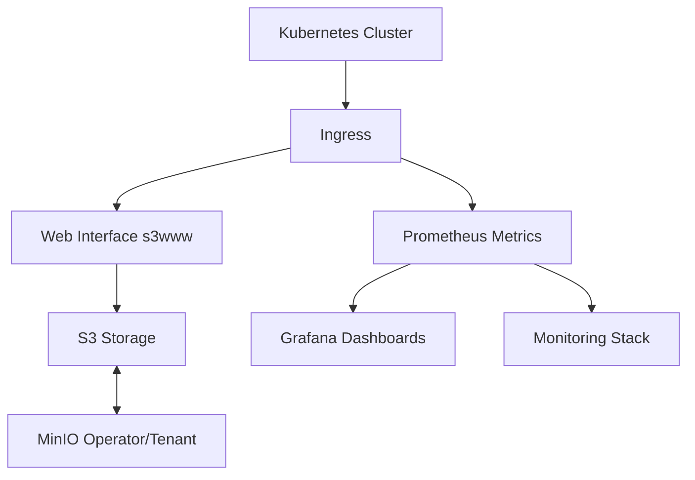

# UP42 Infrastructure

## Overview

This repository contains the Infrastructure as Code (IaC) implementation for the UP42 infrastructure, focusing on deploying a MinIO-based S3 storage solution with a web interface. The solution is designed to be deployed on Kubernetes and managed through Terraform.

Note: another solution introduced is ArgoCD

### Architecture



The infrastructure consists of the following key components:

1. **MinIO Operator**: Manages MinIO tenants in the Kubernetes cluster
2. **MinIO Tenant**: Provides S3-compatible object storage
3. **Web Interface**: Serves static content from S3
4. **Monitoring**: Prometheus metrics and Grafana dashboards
5. **Infrastructure Management**: Terraform for IaC

## Prerequisites

- Kubernetes cluster (tested with k3d)
- k3d ~= v5.8.3
- Terraform >= 1.0.0
- Helm >= 3.0.0
- kubectl ~ v1.33.1
- Make (for using the provided Makefile)
- Available resources (2 CPU, 2-3GB RAM)

#### Required Tools Installation (on MacOS) - for Linux find your way :D

```bash
# Install k3d
brew install k3d

# Install Terraform
brew install terraform

# Install Helm
brew install helm

# Install kubectl
brew install kubectl
```

## Repository Structure

```
.
├── bootstrap/             # Bootstrap configurations for k3d cluster
├── bootstrap2             # Alternative Bootstrap configurations for k3d cluster
├── grafana-dashboards/    # Grafana dashboard definitions
├── helm/                  # Helm charts
├── terraform/             # Terraform configurations
│   ├── environments/      # Environment-specific configurations
│   │   ├── dev/          # Development environment
│   └── modules/          # Reusable Terraform modules
│       ├── minio-operator/  # MinIO operator module
│       ├── minio-tenant/    # MinIO tenant module
│       └── helm-s3www/      # Web interface module
├── Makefile              # Build and deployment automation
```

## Deployment

### 1. Environment Setup

For terraform setup choose your target environment (dev) and prepare the configuration (it's not required there is a default values):

```bash
# For development
cd terraform/up42/dev
cp terraform.tfvars.example terraform-dev.tfvars

# Edit terraform.tfvars with your specific values
```

### 2. Infrastructure Deployment

```bash
# Deploy solution1 using k3d cluster and terraform
make deploy-solution1
# Or
k3d cluster create --config bootstrap2/k3d-bootstrap-cluster.yaml
terraform init && terraform apply -auto-approve
# Or if you are not using k3d and using minikube just create a cluster and run tf command
minikube start --cpus 2 --memory 4000MB
minikube addons enable ingress # This isn't the ideal solution, this approach was chosen to simplify the demo.


# Deploy solution2 using k3d cluster and argocd
make deploy-solution2
# Or
k3d cluster create --config bootstrap/k3d-bootstrap-cluster.yaml
```

###### Average time to service to be ready 7-8 minutes

##### Access the Web Interface ➡️ [UP42 Web UI](http://s3www.up42.abdalazizmoh.com)

##### Access ArgoCD Dashboard ➡️ [ArgoCD UI](http://argocd.up42.abdalazizmoh.com)

##### Monitoring and Observability ➡️ [Grafana UI](http://grafana.up42.abdalazizmoh.com)

```bash
# get secret for grafana instance
kubectl -n monitoring get secrets prometheus-grafana -o yaml | yq '.data | to_entries | .[] | {.key: (.value|@base64d)}'
```

### 3. Verification

```bash
# Check MinIO operator status
kubectl get pods -n minio-operator

# Check MinIO tenant status
kubectl get pods -n tenant-ns

# Check web interface status
kubectl get pods -n s3www
```

### 3. Cleanup

```bash
# Clean up cluster and deployment
make clean
```

### Metrics

The solution includes:
- Prometheus metrics for MinIO
- Grafana dashboards for visualization (Importing the dashboard requires an additional step: execute scripts/import-dashboard.sh)
- ServiceMonitor for metrics collection

Access metrics:
```bash
# Port forward Prometheus
kubectl port-forward svc/prometheus-operated 9090:9090 -n monitoring

# Access Grafana
kubectl port-forward svc/prometheus-grafana 3000:3000 -n monitoring
```
Or using URL: [Grafana UI](http://grafana.up42.abdalazizmoh.com)

### Logging

Logs can be accessed through:
```bash
# MinIO operator logs
kubectl logs -n minio-operator -l app=operator=leader

# MinIO tenant logs
kubectl logs -n tenant-ns -l v1.min.io/tenant=up42-minio

# Web interface logs
kubectl logs -n s3www -l app.kubernetes.io/instance=dev
```

## Troubleshooting

### Common Issues

1. **MinIO Pod Not Starting**
   ```bash
   # Check pod status
   kubectl describe pod -n tenant-ns -l v1.min.io/tenant=up42-minio

   # Check logs
   kubectl logs -n tenant-ns -l v1.min.io/tenant=up42-minio
   ```

2. **Web Interface Not Accessible**
   ```bash
   # Check service status
   kubectl get svc -n s3www dev

   # Check pod status
   kubectl get pods -n s3www -l app=s3www
   ```

### Support

For issues and support:
1. Check the troubleshooting guide
2. Review the logs
3. Consult the documentation
4. Open an issue in the repository

## Contributing

Please read [CONTRIBUTING.md](CONTRIBUTING.md) for details on our code of conduct and the process for submitting pull requests.

## License

This project is licensed under the terms of the license included in the repository.
