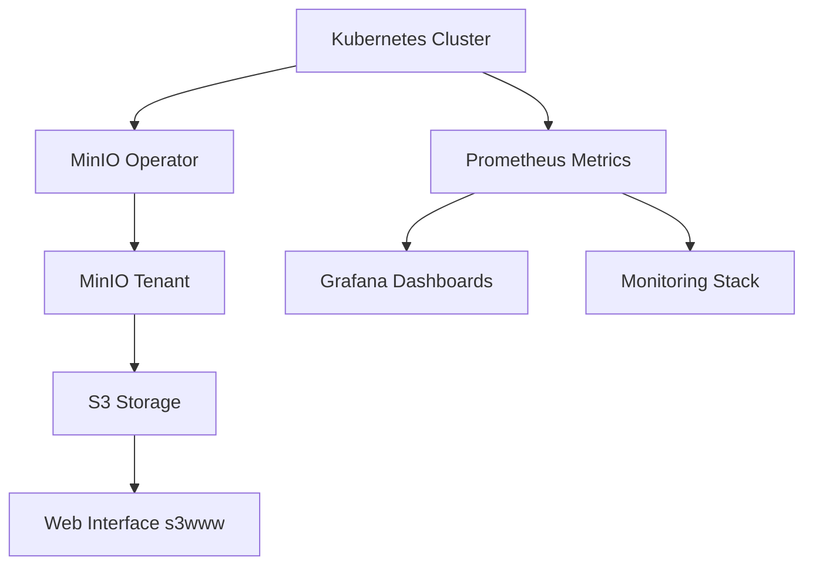

# UP42 Infrastructure

## Overview

This repository contains the Infrastructure as Code (IaC) implementation for the UP42 infrastructure, focusing on deploying a MinIO-based S3 storage solution with a web interface. The solution is designed to be deployed on Kubernetes and managed through Terraform.

### Architecture



The infrastructure consists of the following key components:

1. **MinIO Operator**: Manages MinIO tenants in the Kubernetes cluster
2. **MinIO Tenant**: Provides S3-compatible object storage
3. **Web Interface**: Serves static content from S3
4. **Monitoring**: Prometheus metrics and Grafana dashboards
5. **Infrastructure Management**: Terraform for IaC

## Prerequisites

- Kubernetes cluster (tested with k3d)
- Terraform >= 1.0.0
- Helm >= 3.0.0
- kubectl
- Make (for using the provided Makefile)

### Required Tools Installation

```bash
# Install k3d
brew install k3d

# Install Terraform
brew install terraform

# Install Helm
brew install helm

# Install kubectl
brew install kubectl
```

## Repository Structure

```
.
├── bootstrap/              # Bootstrap scripts and configurations
├── grafana-dashboards/    # Grafana dashboard definitions
├── helm/                  # Helm charts
├── terraform/             # Terraform configurations
│   ├── environments/      # Environment-specific configurations
│   │   ├── dev/          # Development environment
│   │   └── prod/         # Production environment
│   └── modules/          # Reusable Terraform modules
│       ├── minio-operator/  # MinIO operator module
│       ├── minio-tenant/    # MinIO tenant module
│       └── helm-s3www/      # Web interface module
├── Makefile              # Build and deployment automation
```

## Deployment

### 1. Environment Setup

Choose your target environment (dev/prod) and prepare the configuration:

```bash
# For development
cd terraform/environments/dev
cp terraform.tfvars.example terraform.tfvars

# Edit terraform.tfvars with your specific values
```

### 2. Infrastructure Deployment

```bash
# Deploy k3d cluster
make deploy
# Or
k3d k3d cluster create --config bootstrap/k3d-bootstrap-cluster.yaml


# Review the planned changes
terraform plan

# Apply the configuration
terraform apply
#Or
terraform-apply -auto-approve
```

### 3. Verification

```bash
# Check MinIO operator status
kubectl get pods -n minio-operator

# Check MinIO tenant status
kubectl get pods -n tenant-ns

# Access the web interface
kubectl port-forward svc/s3www 8080:80 -n tenant-ns
```

## Access the Web Interface

➡️ [UP42 Web UI](http://s3www.up42.abdalazizmoh.com)

## Access ArgoCD Dashboard

➡️ [ArgoCD UI](http://argocd.up42.abdalazizmoh.com)

## Configuration

### MinIO Configuration

The MinIO tenant can be configured through Terraform variables:

```hcl
module "minio_tenant" {
  source = "../../modules/minio-tenant"

  tenant_name = "up42-minio"
  pool_servers = 2
  pool_volumes = 2
  pool_size    = "1Gi"

  # Access credentials
  access_key = var.minio_access_key
  secret_key = var.minio_secret_key

  # Additional configuration
  metrics_enabled = true
  prometheus_operator_enabled = true
}
```

### Web Interface Configuration

The web interface can be configured through the helm-s3www module:

```hcl
module "s3www" {
  source = "../../modules/helm-s3www"

  release_name = "s3www"
  namespace    = "tenant-ns"

  # Resource configuration
  resources = {
    requests = {
      cpu    = "100m"
      memory = "128Mi"
    }
    limits = {
      cpu    = "200m"
      memory = "256Mi"
    }
  }
}
```

## Monitoring and Observability

### Metrics

The solution includes:
- Prometheus metrics for MinIO
- Grafana dashboards for visualization
- ServiceMonitor for metrics collection

Access metrics:
```bash
# Port forward Prometheus
kubectl port-forward svc/prometheus-server 9090:9090 -n monitoring

# Access Grafana
kubectl port-forward svc/grafana 3000:3000 -n monitoring
```

### Logging

Logs can be accessed through:
```bash
# MinIO operator logs
kubectl logs -n minio-operator -l app=minio-operator

# MinIO tenant logs
kubectl logs -n tenant-ns -l app=minio
```

## Security Considerations

1. **Access Control**
   - MinIO credentials are managed as sensitive variables
   - RBAC is configured for Kubernetes resources
   - Network policies restrict pod-to-pod communication

2. **Data Protection**
   - TLS encryption for data in transit
   - Volume encryption for data at rest
   - Regular backup procedures

3. **Security Best Practices**
   - Regular security updates
   - Minimal RBAC permissions
   - Network isolation
   - Resource limits and requests

## Troubleshooting

### Common Issues

1. **MinIO Pod Not Starting**
   ```bash
   # Check pod status
   kubectl describe pod -n tenant-ns -l app=minio

   # Check logs
   kubectl logs -n tenant-ns -l app=minio
   ```

2. **Web Interface Not Accessible**
   ```bash
   # Check service status
   kubectl get svc -n tenant-ns s3www

   # Check pod status
   kubectl get pods -n tenant-ns -l app=s3www
   ```

### Support

For issues and support:
1. Check the troubleshooting guide
2. Review the logs
3. Consult the documentation
4. Open an issue in the repository

## Contributing

Please read [CONTRIBUTING.md](CONTRIBUTING.md) for details on our code of conduct and the process for submitting pull requests.

## License

This project is licensed under the terms of the license included in the repository.
